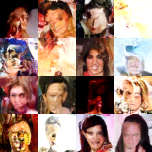
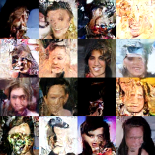

# face-diffusion

A from-scratch DDPM (denoising diffusion probabilistic model) in Rust, trained on celebrity faces. No pretrained weights, no diffusion library — the network learns to reverse a fixed noising process, then sampling starts from pure random noise and iteratively denoises it into a novel 64×64 face.

Deliberately small (64×64 images, a 2-level U-Net, ~1.1M parameters) so it trains fast enough on a single GPU to actually iterate on, rather than aiming for production-quality output. Example output, sampled from the EMA weights after 23,300+ training steps plus a further run with EMA enabled:



Several samples are clearly recognizable faces with realistic skin tones, but many are still warped or double-exposed — that's the tiny model's capacity ceiling, not a bug. See [Results](#results) below.

## Pipeline

| Stage | File | What it does |
|---|---|---|
| 1 | [Cargo.toml](Cargo.toml) | [Candle](https://github.com/huggingface/candle) (pure-Rust ML framework); Metal on macOS, CPU elsewhere by default, optional CUDA |
| 2 | [src/data.rs](src/data.rs) | Loads face images, center-crops + resizes to 64×64, normalizes to `[-1, 1]` |
| 3 | [src/schedule.rs](src/schedule.rs) | Linear β noise schedule; `q_sample` (forward diffusion) and `p_sample` (one reverse step) |
| 4 | [src/unet.rs](src/unet.rs) | 2-level U-Net noise predictor with sinusoidal timestep conditioning |
| 5 | [src/train.rs](src/train.rs) | Training loop: predict the noise added to a randomly-noised image, MSE loss, AdamW |
| 6 | [src/sample.rs](src/sample.rs) | Reverse sampling loop (pure noise → image) and grid-PNG export |
| — | [src/main.rs](src/main.rs) | CLI entry point wiring it all together |

## Setup

Requires the Rust toolchain (`rustc`/`cargo`) and, for the dataset step, a throwaway Python virtualenv.

### 1. Get the dataset

Not part of the Rust pipeline — a one-off export of 20,000 images from a landmark-aligned CelebA mirror into `data/faces/`:

```sh
python3 -m venv .venv && source .venv/bin/activate
pip install huggingface_hub
python3 scripts/export_faces.py
```

This must be the *aligned* CelebA (eyes/nose/mouth at consistent pixel positions across the dataset) — an unaligned mirror will train just fine numerically but the output will never form a coherent face, since a small unconditional model has no other signal telling it where facial features should be. See `scripts/export_faces.py` for the exact source used.

### 2. Build

```sh
cargo build --release
```

candle-core/candle-nn are pinned to a specific upstream commit and patched locally in `vendor/candle/` — see [Known issues](#known-issues-fixed-locally) for why.

### Platform support

- **macOS**: builds with the Metal GPU backend automatically.
- **Linux/Windows with an NVIDIA GPU**: `cargo build --release --features cuda` (requires the CUDA toolkit installed).
- **Everything else** (including AMD-GPU machines like an AMD mini PC, e.g. a GEM12+ — Candle has no ROCm/Vulkan backend): builds and runs CPU-only automatically, no flags needed. Expect it to be noticeably slower than GPU — see [Usage](#usage) for the rate we measured on CPU vs. Metal.

`src/main.rs` tries Metal, then CUDA, then falls back to CPU at runtime, picking whichever backend was actually compiled in. Verified end-to-end on real non-Mac hardware (an AMD mini PC, CPU-only path) in addition to `cargo check --target x86_64-unknown-linux-gnu`; the `cuda` feature itself is untested (no NVIDIA hardware available while building this).

CPU throughput is noticeably more sensitive to memory bandwidth than to core count or clock speed for this workload - on hardware with constrained memory bandwidth (e.g. single-channel RAM), reducing `batch_size` in `main.rs` and/or capping threads with `RAYON_NUM_THREADS=<n>` can measurably help by shrinking the per-step working set and reducing contention, sometimes more than adding cores does.

## Usage

```sh
# Train. Resumes automatically from checkpoints/unet.safetensors if it exists.
# Saves a checkpoint every 500 steps (configurable in main.rs) and at the end.
cargo run --release -- <steps>       # e.g. cargo run --release -- 5000

# Generate a grid of images from the EMA checkpoint (falls back to the raw
# training weights if no EMA checkpoint exists yet).
cargo run --release -- sample <n>        # e.g. cargo run --release -- sample 16
cargo run --release -- sample <n> raw    # raw training weights, for comparison
# writes samples/grid.png
```

Training also keeps an exponential moving average (EMA, decay 0.999) of the weights in [src/ema.rs](src/ema.rs), saved alongside the main checkpoint as `checkpoints/unet_ema.safetensors`. Sampling from the EMA rather than the raw weights removes much of the speckle/blotch noise caused by step-to-step weight jitter. When resuming a checkpoint that predates EMA, the average is initialized from the current weights; give it a few thousand steps before judging samples.

Same checkpoint and same starting noise (candle's Metal RNG uses a fixed default seed), raw weights on the left, EMA weights on the right — the EMA removes most of the grainy high-frequency texture:

| Raw weights | EMA weights |
|---|---|
|  |  |

At ~1.1 steps/s on an M4's Metal GPU (batch size 64), expect roughly 4,000 training steps per hour (up from ~0.4 steps/s before the Metal kernel fixes in [Known issues](#known-issues-fixed-locally) items 6-7). Plain CPU (no GPU backend compiled in or available) measured at ~0.28 steps/s on the same machine, before those fixes — slower, but still usable; exact CPU throughput on different hardware (e.g. an AMD mini PC) will vary.

## Results

Loss plateaus very early (within a few hundred steps) to a floor around 0.02-0.05 and barely moves after that — this is an inherent property of the MSE noise-prediction objective, not a sign that training has stalled. **Loss is a poor signal for visual progress here; you have to actually sample and look.** Empirically, with this exact setup:

- **~1,500 steps**: pure color/skin-tone blobs, no structure at all.
- **~7,500 steps**: real (if blurry) facial structure starts appearing — hair, eye regions, rough face outlines.
- **~23,000 steps**: consistently recognizable, if soft/impressionistic, faces.

Further training keeps helping but with diminishing returns; the tiny architecture (32 base channels, 2 levels) caps how sharp it can ever get regardless of training time. The natural next lever is model capacity, not more steps — e.g. doubling to 64 base channels (~4x compute).

## Known issues (fixed locally)

Real bugs in candle surfaced while building and porting this, none yet fixed upstream at the commit this project pins to:

1. **Build failure on Apple Silicon stable Rust**: an unstable NEON fp16 intrinsic in candle-core's CPU backend. Fixed upstream since (`vendor/candle` is pinned to a commit that already includes that fix).
2. **Silently wrong gradients**: candle-core's Metal conv2d backward pass fed a non-contiguous tensor into im2col/gemm when computing the weight gradient, producing an incorrect gradient with no error — training would have silently diverged. Patched locally in `vendor/candle/candle-core/src/backprop.rs` (`.contiguous()` before the weight-gradient conv calls). See [huggingface/candle#3839](https://github.com/huggingface/candle/pull/3839) (unmerged at time of writing).
3. **Unbounded Metal buffer-pool memory growth**: long sequences of GPU ops (e.g. the 400-step sampling loop) could grow wired memory without bound and eventually crash with `kIOGPUCommandBufferCallbackErrorOutOfMemory`. Also patched from the same upstream PR, in `vendor/candle/candle-core/src/metal_backend/` and `vendor/candle/candle-metal-kernels/src/metal/commands.rs`.
4. **x86_64 build failure, version-dependent**: `candle-core`'s AMX-detection code calls `core::arch::x86_64::__cpuid_count` from a safe function. Its safety classification differs across rustc versions — older toolchains require an `unsafe` block around it or fail to compile (`E0133`); a newer toolchain used while porting to other hardware had reclassified it as safe, making that same block an "unnecessary unsafe" warning instead. Never hit on this project's own arm64 Mac, since that code path is gated to `x86_64` builds only. Patched locally in `vendor/candle/candle-core/src/quantized/repack_x86.rs` with `#[allow(unused_unsafe)]`, which keeps it correct (and warning-free) on both.
5. **Deprecated-constant warning from a module/type name collision**: two files (`candle-core/src/cpu/erf.rs`, `candle-nn/src/attention/cpu_flash/standard.rs`) had an unnecessary `use std::f64;`/`use std::f32;` import that shadowed the primitive type name, causing `f64::INFINITY` written elsewhere in those files to silently resolve to the deprecated module-level constant instead of the modern primitive associated constant. Fixed by deleting the unused imports.

6. **Slow Metal kernels from 64-bit integer division**: candle's Metal kernels compute tensor element positions with `size_t` (64-bit) division and modulo. Apple GPUs have no native 64-bit integer divide, so it's emulated in software, and it was the dominant cost of every conv2d (`im2col`), every strided copy and every broadcast op. Since the thread index is already a 32-bit `uint`, the index math is done in 32-bit instead in `vendor/candle/candle-metal-kernels/src/metal_src/conv.metal` (`im2col`, `conv_transpose2d`) and in the `get_strided_index` helpers of `affine`, `binary`, `cast`, `indexing`, `ternary`, `unary` and `utils.metal`. Results are unchanged; a single 64×64 conv2d went from ~73 ms to ~9 ms.
7. **Slow conv2d input gradient**: the conv2d backward pass computed the input gradient with Metal's naive one-thread-per-output `conv_transpose2d` kernel. For stride 1 (every conv here except the two downsamples), `vendor/candle/candle-core/src/backprop.rs` now computes the identical result as a regular conv2d with the kernel spatially flipped and its in/out channels swapped, which goes through the much faster im2col + gemm path. Checked against `conv_transpose2d` on CPU and Metal (max abs difference ~1e-5).

An eighth bug was in this project's own code, not candle's: `src/sample.rs`'s reverse loop feeds each step's output into the next step's forward pass through the U-Net's trainable weights, which still builds an autodiff graph even though sampling never calls `.backward()`. Left attached, that graph - and every prior step's retained activations - grew across all 400 sequential steps until memory was exhausted. Fixed with `.detach()` each step.

`vendor/candle/` is a trimmed copy of just the crates this project depends on (candle-core, candle-nn, candle-metal-kernels, candle-kernels — the last only used by the optional `cuda` feature), not the full upstream monorepo.
